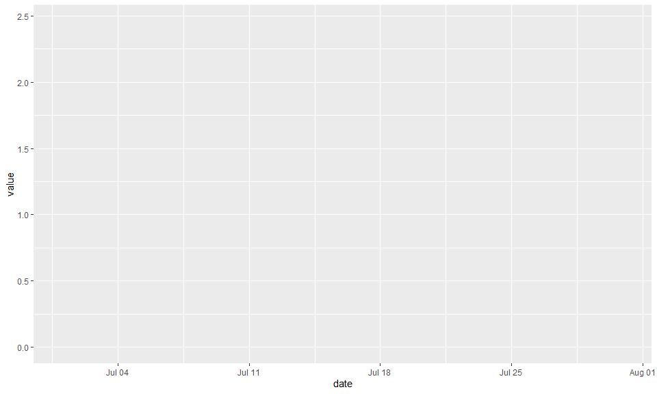
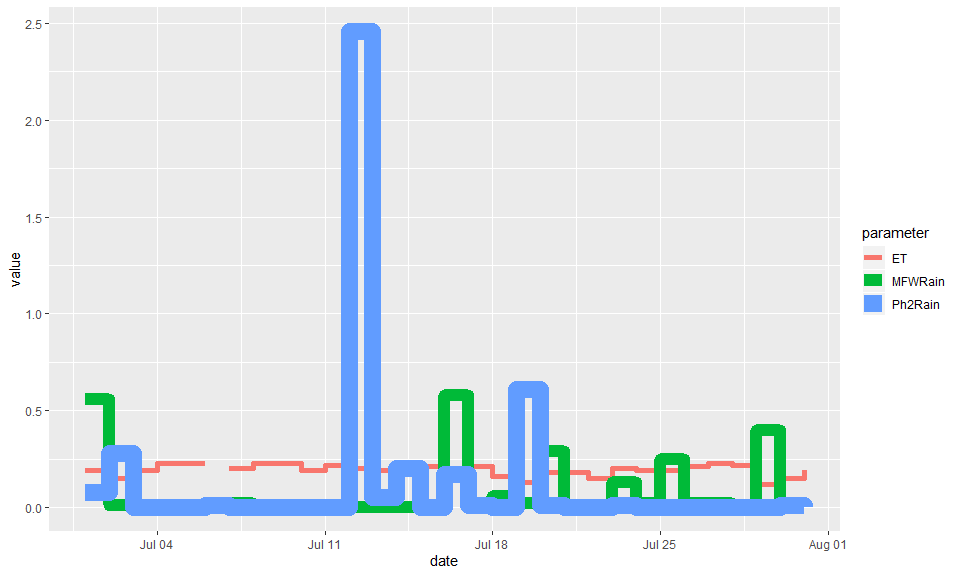
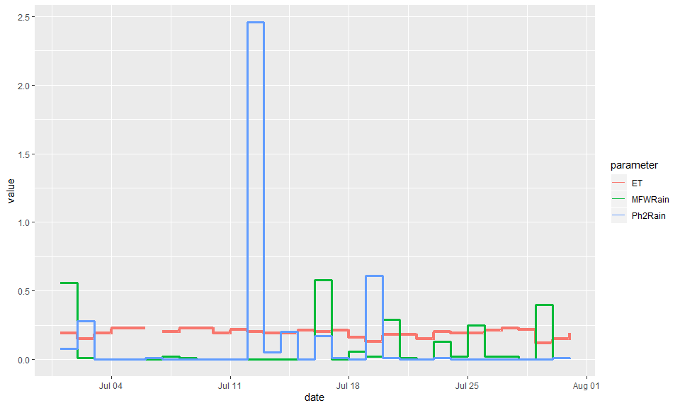
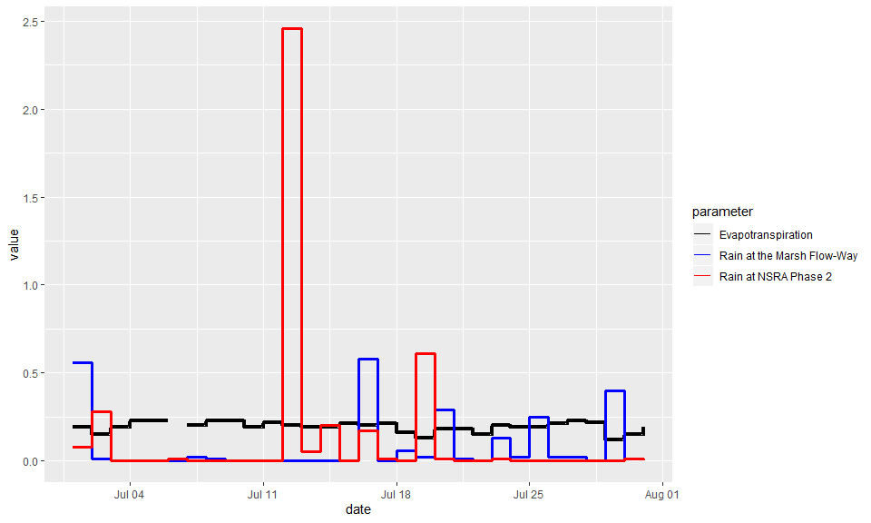
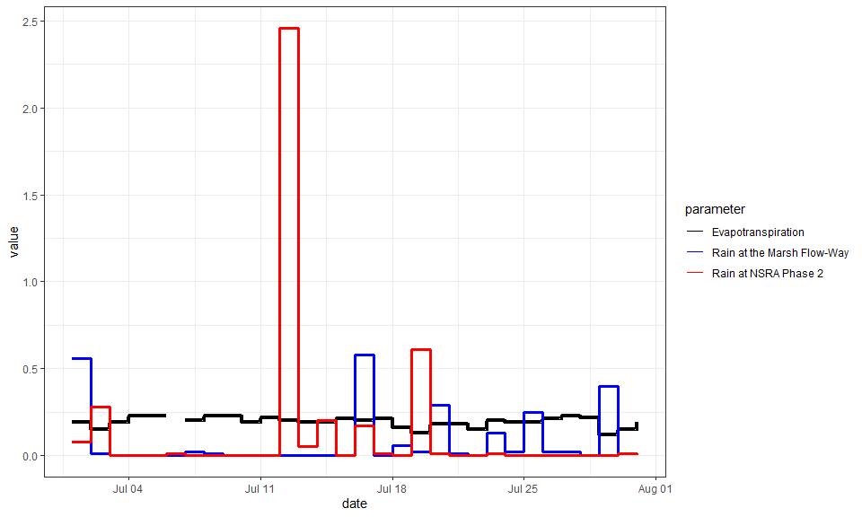
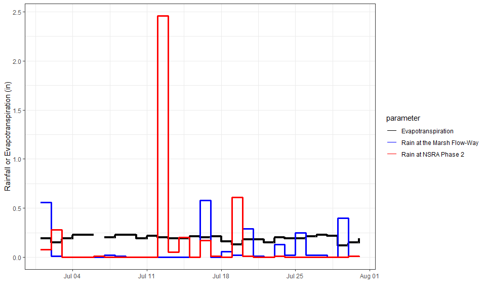
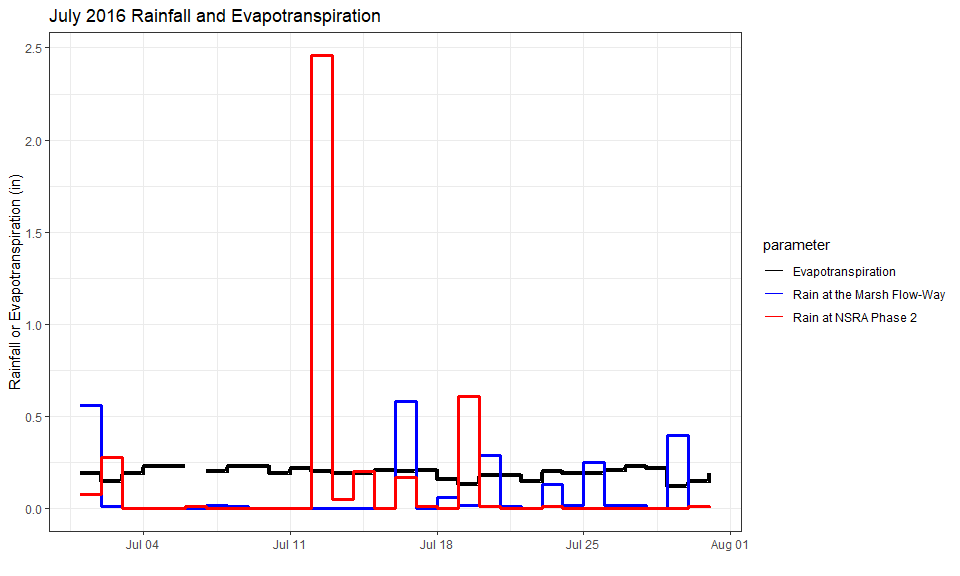
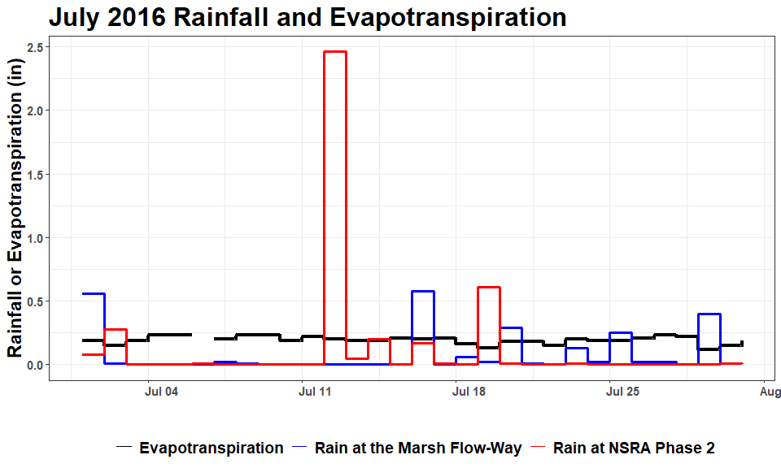
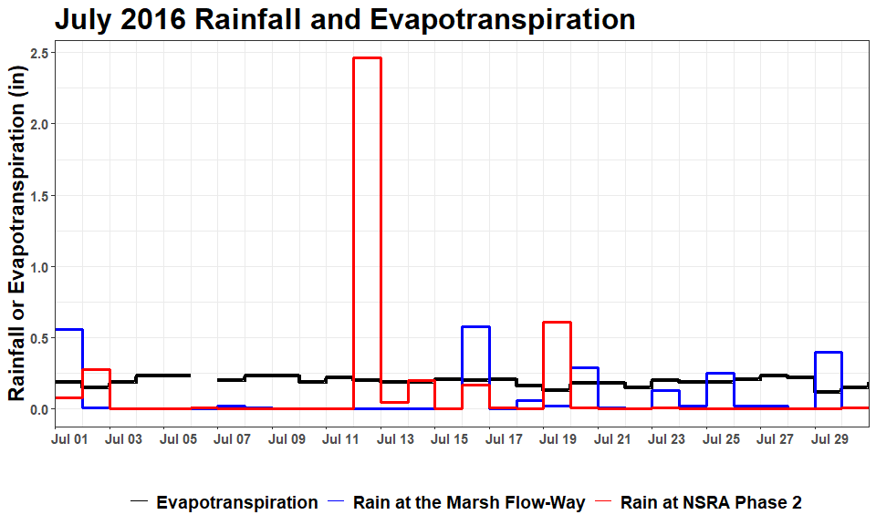
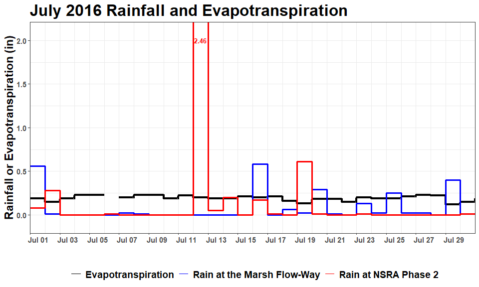

This tutorial illustrates how to use the R package **ggplot2** to build
a simple plot. This plot was designed for land managers at the St. Johns
River Water Management District interested in rainfall and
evapotranspiration in the Lake Apopka area to determine whether the
conditions are appropriate for prescribed burns. The plots are generated
at the beginning of each month and contain data from the previous month.

## Required packages

This script requires the following packages:

``` r
library(tidyverse)
library(lubridate)    ## required for the month() function
library(scales)       ## required for the date_format() function
```

## Input data

The input data for this plot is a data frame called Ap\_Rain with the
following structure:  

<table style="width:100%" border="0">

<tr>

<th>

Column

</th>

<th>

Description

</th>

<th>

Coordinates

</th>

</tr>

<tr>

<td>

date

</td>

<td>

date in Date format

</td>

<td>

</td>

</tr>

<tr>

<td>

MFWRain

</td>

<td>

Rain in inches at the Lake Apopka Marsh Flow-Way

</td>

<td>

Lat:28.67143722<br>Long:-81.67500639

</td>

</tr>

<tr>

<td>

Ph2Rain

</td>

<td>

Rain in inches at the Lake Apopka North Shore Restoration Area, Phase 2

</td>

<td>

Lat:28.63771<br>Long:-81.54675

</td>

</tr>

<tr>

<td>

ET

</td>

<td>

Evapotranspiration in inches from the Apopka IFAS FAWN station

</td>

<td>

</td>

</tr>

</table>

``` r
Ap_Rain <- read_csv("Ap_Rain.csv", col_types = "Dnnn")
```

The first few rows of the table look like this:

|    date    | MFWRain | Ph2Rain |  ET  |
| :--------: | :-----: | :-----: | :--: |
| 2016-07-01 |  0.56   |  0.08   | 0.19 |
| 2016-07-02 |  0.01   |  0.28   | 0.15 |
| 2016-07-03 |    0    |    0    | 0.19 |
| 2016-07-04 |    0    |    0    | 0.23 |
| 2016-07-05 |    0    |    0    | 0.23 |
| 2016-07-06 |    0    |  0.01   |  NA  |

This data frame is not formatted well for ggplot, which works best with
single record per line data. The **pivot\_longer** function in the
**tidy** package is a quick and easy way to pivot from wide to long
format:

``` r
df.long <- Ap_Rain %>%
    pivot_longer(cols = c(MFWRain, Ph2Rain, ET), names_to = "parameter")
```

Now the first few rows look like this:

|    date    | parameter | value |
| :--------: | :-------: | :---: |
| 2016-07-01 |  MFWRain  | 0.56  |
| 2016-07-01 |  Ph2Rain  | 0.08  |
| 2016-07-01 |    ET     | 0.19  |
| 2016-07-02 |  MFWRain  | 0.01  |
| 2016-07-02 |  Ph2Rain  | 0.28  |
| 2016-07-02 |    ET     | 0.15  |

From month to month, the land managers were interested in seeing the
same basic plot with updated data. Sometimes there are high rainfall
values that would skew the y-axis if we allowed ggplot to autoscale the
y-axis each month. Instead, we can fix the y-axis scale to range between
0 and 2. In order to handle high rainfall events, we can a new variable,
**high**, that is used to annotate the plot whenever rainfall exceeds 2
inches:

``` r
df.long <- df.long %>%
    mutate(high = case_when(value > 2 ~ value, value <= 2 ~ NA_real_)) %>%
    arrange(desc(high))
```

After sorting by the new variable, *high*, the first few rows of the
data frame now look like this:

|    date    | parameter | value | high |
| :--------: | :-------: | :---: | :--: |
| 2016-07-12 |  Ph2Rain  | 2.46  | 2.46 |
| 2016-07-01 |  MFWRain  | 0.56  |  NA  |
| 2016-07-01 |  Ph2Rain  | 0.08  |  NA  |
| 2016-07-01 |    ET     | 0.19  |  NA  |
| 2016-07-02 |  MFWRain  | 0.01  |  NA  |
| 2016-07-02 |  Ph2Rain  | 0.28  |  NA  |

## ggplot2

The [**ggplot2** package](https://ggplot2.tidyverse.org/) was created by
Hadley Wickham, Chief Scientist at RStudio. **ggplot**, or **g**rammar
of **g**raphics **plot**, is built around the concept of layering
different components of the graphical display. These components include
the **data**, **aesthetic mapping**, **geometric objects**, **scales**,
**statistics**, and **facets**. The basic structure is:

``` r
ggplot(data = yourdata,
       aes(x = your_x_variable,
           y = your_y_variable)) +
    geom_point() +
    scale_x_date(date_breaks = "1 month",
                 date_labels = "%b %Y") +
    stat_sum() +
    facet_wrap(~your_grouping_variable)
```

The following example makes use of the **data**, **aesthetic mapping**,
**geometric objects**, and **scales** components.

## Creating a plot

The first step is to identify the input **data** and **aesthetic
mapping**. This is done within the ggplot function, assigning the
dataframe to the **data** argument and using the **aes** function to
assign variables to x, y, and more. To help illustrate each of the
layers of the plot, we can assign the function to a variable, p, and add
layers to the function with each step.

``` r
p <- ggplot(data = df.long, aes(x = date,
                                y = value,
                                group = parameter,
                                color = parameter,
                                size = parameter)) ; p
```

<!-- -->

As you can see, we have a plot prepared with the x and y variables in
the appropriate place, but there is no geometric object added yet. To
add a **geometric object**, we can simply add a **geom\_\*** function.
In this case we will use a stairstep plot with the **geom\_step**
function.

``` r
p <- p + geom_step() ; p
```

<!-- -->

While the plot shows all the lines, the thickness of the lines varies
considerably. We can change this by using the **scale\_size\_\*** family
of functions. In this case, we use **scale\_size\_manual** because the
variable *parameter* is a discrete variable and we would like to
customize the values assigned to it. By setting the **guide** argument
to “none”, we avoid adding a legend indicating the sizes of the lines.

``` r
p <- p + scale_size_manual(values = c(1.6, 1.4, 1.4), guide = "none") ; p
```

<!-- -->

The colors and labels for the lines can be changed using the
**scale\_color\_\*** set of functions. As with the size variable, we can
use **scale\_color\_manual** to customize the color values and labels
for a discrete variable.

``` r
p <- p + scale_color_manual(values = c("ET" = "black", "MFWRain" = "blue", "Ph2Rain" = "red"),
                            labels = c("Evapotranspiration",
                                      "Rain at the Marsh Flow-Way",
                                      "Rain at NSRA Phase 2")) ; p
```

<!-- -->

**ggplot2** has built-in themes that allow you to change the non-data
aspects of the chart. Here we switch to **theme\_bw**, which is a simple
black and white theme.

``` r
p <- p + theme_bw() ; p
```

<!-- -->

We can update the axis labels with the **xlab** and **ylab** functions.
Here we remove the x label and add a more informative y label.

``` r
p <- p + 
    xlab("") +
    ylab("Rainfall or Evapotranspiration (in)"); p
```

<!-- -->

We can also add a title with **ggtitle**.

``` r
p <- p + ggtitle(paste(month(df.long$date[1], label = T, abbr = F),
                       year(df.long$date[1]),
                       "Rainfall and Evapotranspiration")) ; p
```

<!-- -->

The **theme** function is where we can change text elements and design
components. Here we increase text size for axis labels and titles and
horizontally adjust x-axis text so that the left edge aligns close to
the tick marks. We remove the legend title, increase legend text size,
move the legend to the bottom, and increase the title text size.

``` r
p <- p + theme(axis.text = element_text(face = "bold", size = 11),
               axis.title = element_text(face = "bold", size = 17),
               axis.text.x = element_text(hjust = 0.1),
               legend.title = element_blank(),
               legend.text = element_text(face = "bold", size = 14),
               legend.position = "bottom",
               title = element_text(face = "bold", size = 20)) ; p
```

<!-- -->

To improve the x-axis labeling, we first create a vector that defines
the date breaks to span from the beginning to the end of the time series
(month), in 2 day increments.

``` r
break.vec <- c(seq(from = min(df.long$date),
                   to = max(df.long$date) - 1,
                   by = "2 days"))
break.vec
```

    ##  [1] "2016-07-01" "2016-07-03" "2016-07-05" "2016-07-07" "2016-07-09"
    ##  [6] "2016-07-11" "2016-07-13" "2016-07-15" "2016-07-17" "2016-07-19"
    ## [11] "2016-07-21" "2016-07-23" "2016-07-25" "2016-07-27" "2016-07-29"

Now we can use the **scale\_x\_date** function Set the x-axis labels for
every other day starting on the first day of the month.

``` r
p <- p + scale_x_date(breaks = break.vec,
                      limits = c(min(df.long$date), max(df.long$date)),
                      expand = c(0,0),
                      labels = date_format("%b %d")) ; p
```

<!-- -->

Recall that this plot was designed to be reusable from month to month,
so we want a consistent range displayed on the y-axis. Here we use the
**coord\_cartesian** function to set the y limits to range from 0 to 2
(with a little buffer). Note that **coord\_cartesian** is required here
if we want to show data that goes outside the limits, because the
**ylim** function will omit data points outside the set range.

``` r
p <- p + coord_cartesian(ylim = c(-0.1, 2.1)) ; p
```

<!-- -->

Lastly, we want to know what the rainfall was when it rained more than 2
inches. We can do this using another **geometric object**, adding text
to the plot with the **geom\_text** function. We assign different
**aesthic mapping** arguments to this object, because it should not
inherit from the original **aes** call within **ggpplot**. We do not
want to add this text to the legend, so we set **show.legend** to FALSE.

``` r
p <- p + geom_text(aes(x = date + 0.5,
                       y = 2.0,
                       label = ifelse(is.na(high), "", high),
                       group = parameter,
                       color = parameter,
                       fontface = "bold"),
                   size = 3.5,
                   show.legend = F) ; p
```

<!-- -->

The finished product is a figure that is shared with land managers
monthly to help them with decision-making.
